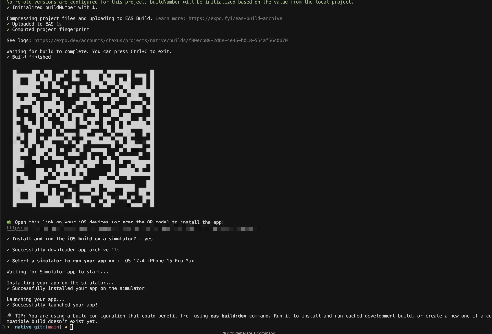
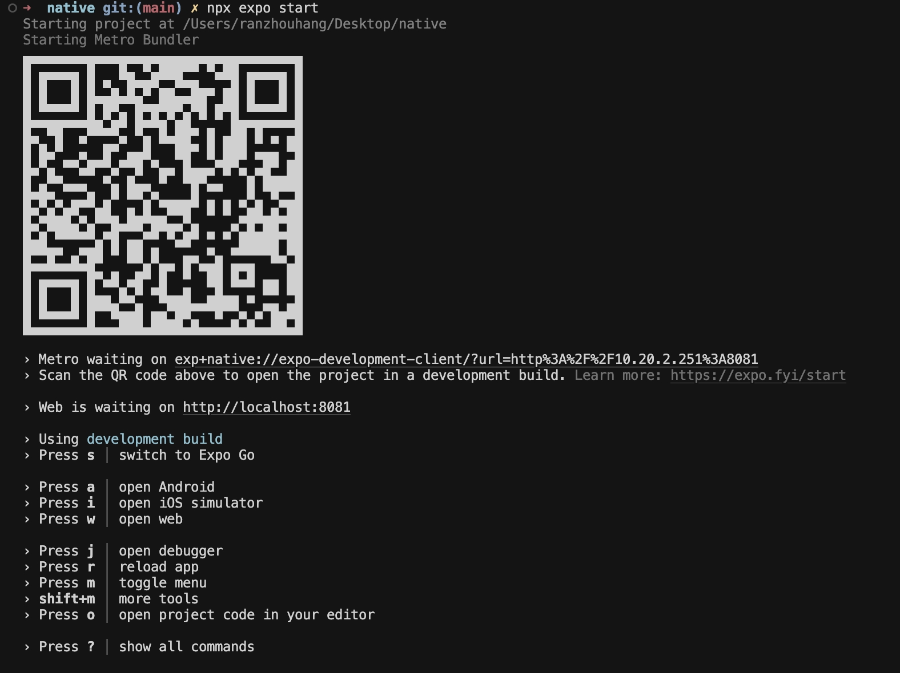
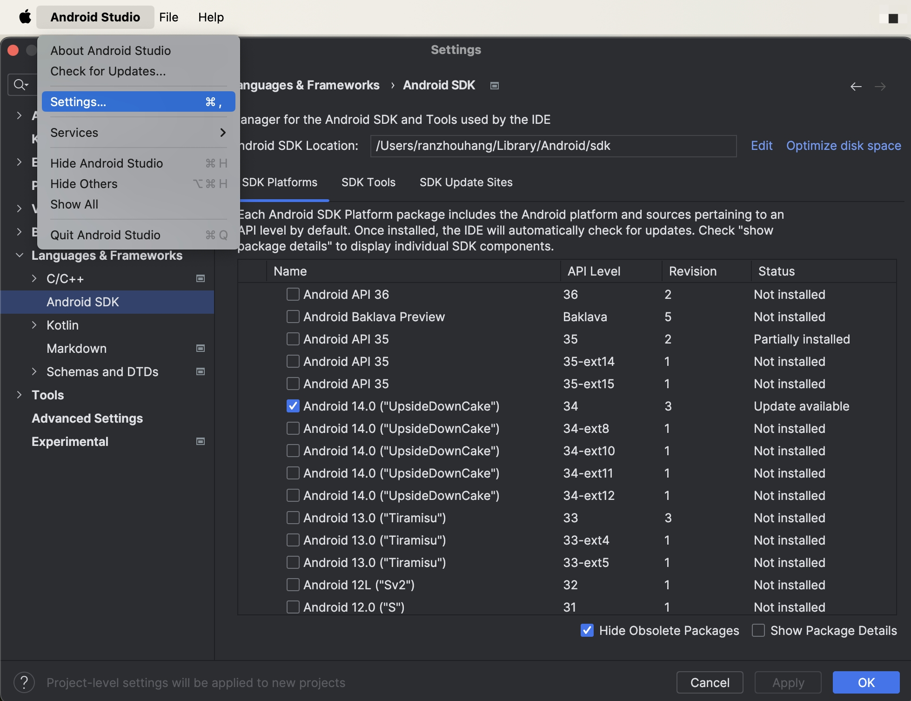
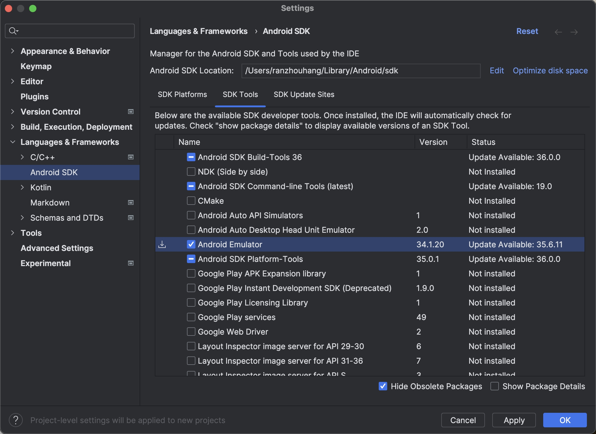
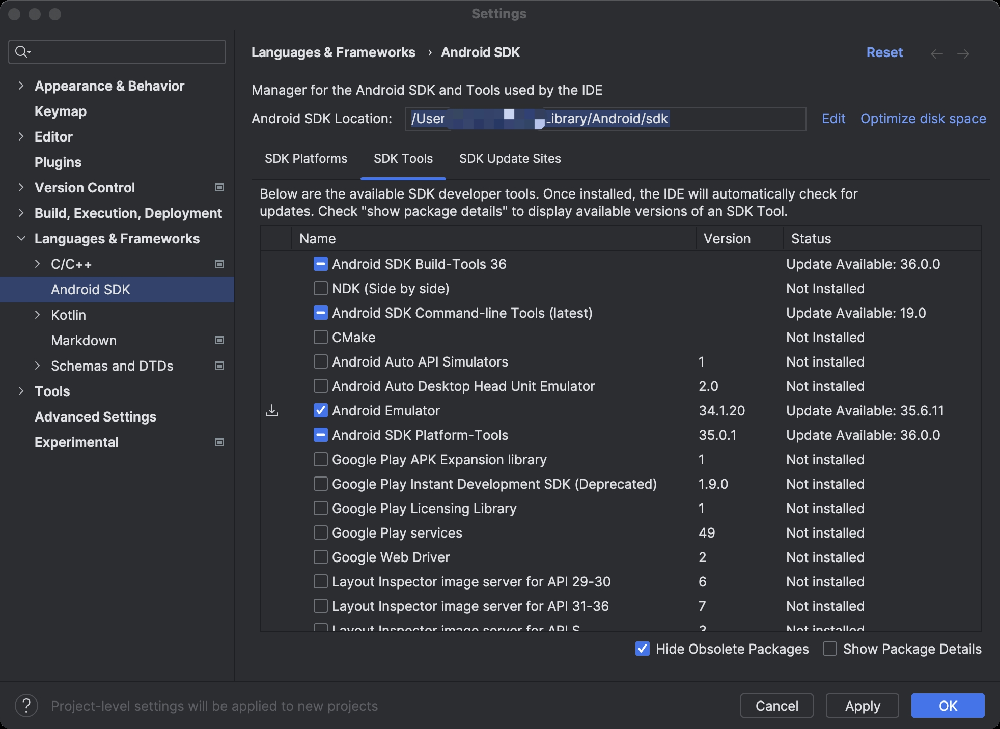

# `React Native`

官方文档：https://reactnative.dev/

## 开发环境

- `iOS device`
- `Android device`
- `iOS Emulator`
- `Android Emulator`

### 1.`iOS Emulator`

1. 在 `Mac` 上安装 `Xcode` 和 `Simulator`
2. 安装 `watchman`

```sh
brew update 
brew install watchman
```

3. 安装 `EAS CLI` 去构建项目

```sh
npm install -g eas-cli
```

4. 创建 `Expo` 账户，同时进行登录

- 注册地址：`https://expo.dev/signup`
- 注册完成后，记住账号，在终端进行登录

```sh
eas login
```

5. 生成配置文件

```sh
eas build:configure
```

6. 给配置文件增加 `iOS Simulator` 的选项

```json
{
  "build": {
    "development": {
      "developmentClient": true,
      "distribution": "internal",
      "ios": {
        "simulator": true
      }
    }
  }
}
```

7. 运行以下命令去创建开发的版本

```sh
eas build --platform ios --profile development
```

构建时间会比较久，看到以下输出说明可以了，同时会自动唤起 `iOS Simulator`.



8. 在模拟器上安装开发的构建

- 构建完成后，`CLI` 将提示您自动下载并安装到 `iOS` 模拟器上。出现提示时，按 `Y` 直接将其安装到模拟器上。
- 如果您错过了这个提示，您可以从终端提供的链接下载构建，并将其拖放到 `iOS` 模拟器上进行安装。

9. 现在，项目和开发环境都有了，可以开始开发了。

```sh
npx expo start
```



- 扫描上面的二维码，可以通过设备去查看。
- i 可以打开 `iOS` 模拟器
- w 可以打开浏览器版

然后就能看到以下的场景：


然后去修改路径：`native/app/(tabs)/index.tsx`:

```tsx
<ThemedView style={styles.titleContainer}>
    <ThemedText type="title">测试标题</ThemedText>
    <HelloWave />
</ThemedView>
```

然后你就发现，`iOS Simulator` 上的页面内容改变了。

### 2. `Android Emulator`

1. 安装 [Android Studio](https://developer.android.com/studio) 及其配置

- 打开 Android Studio 应用程序，单击 More Actions 并选择 SDK 管理器。



2. 打开 Android Studio，进入 Settings；语言与框架 Android SDK。从 SDK 平台选项卡中选择最新的 Android 版本（API 级别）。


3. 然后，单击 SDK Tools 选项卡，确保安装了至少一个版本的 Android SDK Build-Tools 和 Android Emulator。



4. 复制或记住 Android SDK Location 框中列出的路径。



```sh
/Users/chaxus/Library/Android/sdk
```

5. 如果您使用的是 macOS 或 Linux，请在~/中添加一个指向 Android SDK 位置的环境变量。Bash_profile(或~/。如果使用 Zsh，则为 zshrc)。例如：export ANDROID_HOME=/your/path/here。

将以下行添加到/。Zprofile 或~/。ZSHRC(如果使用 bash，则使用~/。Bash_profile 或~/.bashrc) 配置文件：

```sh
export ANDROID_HOME=$HOME/Library/Android/sdk
export PATH=$PATH:$ANDROID_HOME/emulator
export PATH=$PATH:$ANDROID_HOME/platform-tools
```

6. 重新加载当前 shell 中的路径环境变量：

```sh
# for zsh
source $HOME/.zshrc
# for bash
source $HOME/.bashrc
```

7. 最后，确保您可以从终端运行 adb。

```sh
adb
```

8. 安装 `EAS CLI` 去构建项目

```sh
npm install -g eas-cli
```

9. 创建 `Expo` 账户，同时进行登录

- 注册地址：`https://expo.dev/signup`
- 注册完成后，记住账号，在终端进行登录

```sh
eas login
```

10. 生成配置文件

```sh
eas build:configure
```

11. 运行以下命令去创建开发的版本

```sh
eas build --platform android --profile development
```

