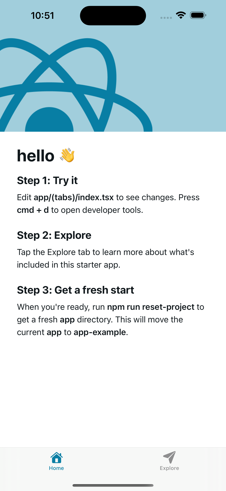

# React Native

官方文档：https://reactnative.dev/

## 开发环境

- iOS device
- Android device
- iOS Emulator
- Android Emulator

### 1. Android device

需要使用 brew 去管理一些开发的依赖

watchman 文档：https://facebook.github.io/watchman/docs/install#macos

```sh
brew install watchman
```

使用 Homebrew 安装名为 Azul Zulu 的 OpenJDK 发行版。该发行版为 Apple Silicon 和 Intel mac 提供了 jdk。

```sh
brew install --cask zulu@17
```

### iOS Emulator

1. 在 Mac 上安装 Xcode 和 Simulator
2. 安装 watchman

```sh
brew update 
brew install watchman
```

3. 安装 EAS CLI 去构建项目

```sh
npm install -g eas-cli
```

4. 创建 Expo 账户，同时进行登录

- 注册地址：https://expo.dev/signup
- 注册完成后，记住账号，在终端进行登录

```sh
eas login
```

5. 生成配置文件

```sh
eas build:configure
```

6. 给配置文件增加 iOS Simulator 的选项

```json
{
  "build": {
    "development": {
      "developmentClient": true,
      "distribution": "internal",
      "ios": {
        "simulator": true
      }
    }
  }
}
```

7. 运行以下命令去创建开发的版本

```sh
eas build --platform ios --profile development
```

构建时间会比较久，看到以下输出说明可以了，同时会自动唤起 iOS Simulator.


8. 在模拟器上安装开发的构建

- 构建完成后，`CLI` 将提示您自动下载并安装到 `iOS` 模拟器上。出现提示时，按 `Y` 直接将其安装到模拟器上。
- 如果您错过了这个提示，您可以从终端提供的链接下载构建，并将其拖放到 `iOS` 模拟器上进行安装。

9. 现在，项目和开发环境都有了，可以开始开发了。

```sh
npx expo start
```


- 扫描上面的二维码，可以通过设备去查看。
- i 可以打开 iOS 模拟器

然后就能看到以下的场景：



然后去修改路径：`native/app/(tabs)/index.tsx`:

```tsx
<ThemedView style={styles.titleContainer}>
    <ThemedText type="title">测试标题</ThemedText>
    <HelloWave />
</ThemedView>
```

然后你就发现，iOS Simulator 上的页面内容改变了。