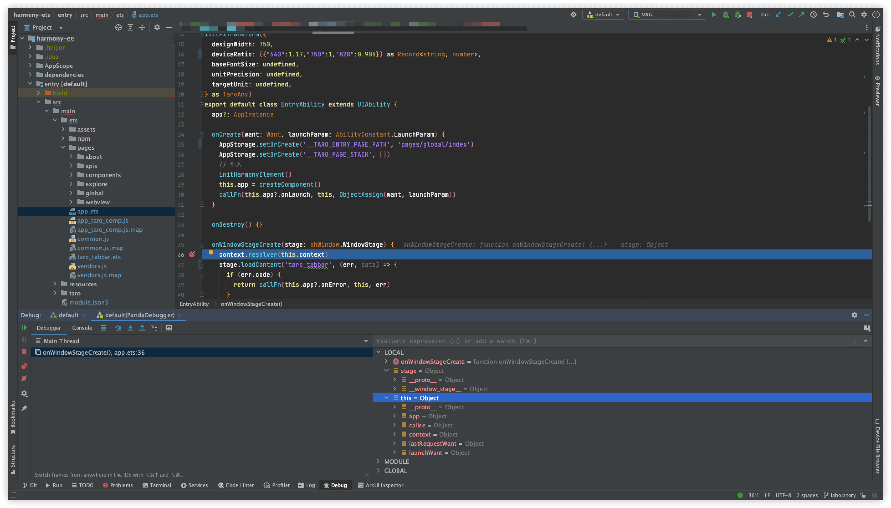

# 鸿蒙

## 一。配置鸿蒙环境

首先要准备鸿蒙运行所需的环境，根据参考文档提示的步骤在 HUAWEI DevEco Studio 的 IDE 中完成 MyApplication 项目的创建，熟悉鸿蒙开发者工具的预览查看等功能。

### 1. 安装、配置 DevEco Studio

（1）登录 [HarmonysOS 应用开发门户](https://developer.huawei.com/consumer/cn/)，点击右上角注册按钮，注册开发者帐号。

（2）进入 [HUAWEI DevEco Studio 下载中心](https://developer.huawei.com/consumer/cn/deveco-studio/)，点击立即下载按钮，下载最新版本的 DevEco Studio IDE。

### 2. 创建 Harmony 主项目

（1）创建新项目，选择需要开发的设备，根据应用配置所需的信息，点击 Finish 按钮，一个新的项目就被创建出来了。

（2）关注目录 `entry/src/main/ets/pages/Index.ets` 下面的文件，熟悉文件结构。`pages` 目录下为页面入口，新建项目的页面目录会包含若干个 `.ets` 文件，应用级配置信息位于 `build-profile.json5`，当前的模块信息、编译信息配置项位于 `entry/build-profile.json5`。[项目结构详情](https://developer.huawei.com/consumer/cn/doc/harmonyos-guides/application-package-structure-stage)。

### 3. 预览 & 调试

（1）DevEco Studio 支持下述方式查看运行效果，链接到鸿蒙官网查看具体步骤

a. [使用预览器 previewer](https://developer.huawei.com/consumer/cn/doc/harmonyos-guides/ide-previewer-arkts-js) 该功能与真机效果可能存在差异，主要用于 UI 样式的预览，主要用于预览 ArkTS 侧经过 @Component 修饰的 UI 组件，在 Taro For Harmony 的开发中无法使用，可以暂时忽略。

b. [使用模拟器](https://developer.huawei.com/consumer/cn/doc/harmonyos-guides/ide-run-emulator) 使用 DevEco Studio 提供的模拟器功能，即可正常调试 Taro 打包出来的鸿蒙应用程序，除了无法使用 IDE 提供的 Profiler 来测量性能外，其余功能和真机并无太大差异，推荐没有真机的开发者优先考虑这种调试方式。

c. [使用本地真机](https://developer.huawei.com/consumer/cn/doc/harmonyos-guides/ide-run-device) 用户真机与电脑相连，打开开发者模式，即可在真机看到效果，这里需要注意的是，真机需要使用纯鸿蒙系统的手机，能够体验到完整的鸿蒙系统功能。

(2) DevEco Studio 真机进行调试

链接上真机后，选择好对应的入口模块，在项目代码中打上断点等信息，在编译器中启动调试即可。

